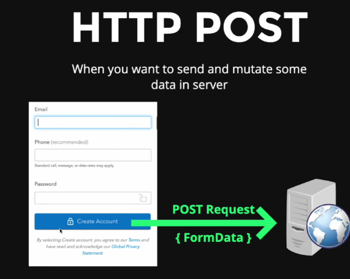

# HTTP Methods

HTTP methods define the type of action a client wants to perform on the server. These are the most common methods:

---

### 1. GET
- The **GET** method is used to request data from the server. It is safe, as it only retrieves information without modifying anything on the server.
  
#### Real-life Example:
- You visit an e-commerce website, and you want to view the details of a product. The browser sends a GET request to fetch the product details.

#### Example:


**Code Example:**
```js
// Server handling a GET request
http.createServer((req, res) => {
  if (req.method === 'GET') {
    res.writeHead(200, { 'Content-Type': 'application/json' });
    res.end(JSON.stringify({ message: 'Product details fetched' }));
  }
});
```
---

### 2. POST

- The POST method is used to send data to the server, typically to create a new resource. It allows the client to submit data that will be processed by the server, such as form data or file uploads.

### Real-life Example:

- When you fill out a sign-up form and submit it, a POST request is sent to create a new user account.
Example URL:

#### Example:



**Code Example:**
```js
// Server handling a POST request
http.createServer((req, res) => {
  if (req.method === 'POST') {
    let body = '';
    req.on('data', chunk => {
      body += chunk.toString();
    });
    req.on('end', () => {
      res.writeHead(200, { 'Content-Type': 'application/json' });
      res.end(JSON.stringify({ message: 'User signed up successfully' }));
    });
  }
});
```
---

### 3. PUT
- The PUT method is used to update an existing resource by replacing it entirely with new data. If the resource does not exist, PUT can also be used to create it.

### Real-life Example:

- When you update your entire profile on a website, such as changing your name and email, a PUT request is sent to update all the information.

---
### 4. PATCH
- The PATCH method is used to partially update an existing resource. Instead of replacing the entire resource like PUT, PATCH only modifies the specific fields that need to be updated.

### Real-life Example:

- When you change only your profile picture on a social media account, a PATCH request is sent to update just that field.

---
### 5. DELETE
- The DELETE method is used to delete a resource from the server. It is often used when you want to remove data, such as deleting a user account or removing a product.

### Real-life Example:

- When you delete your account from a service, a DELETE request is sent to the server to remove the account.


